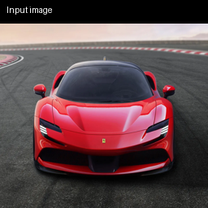
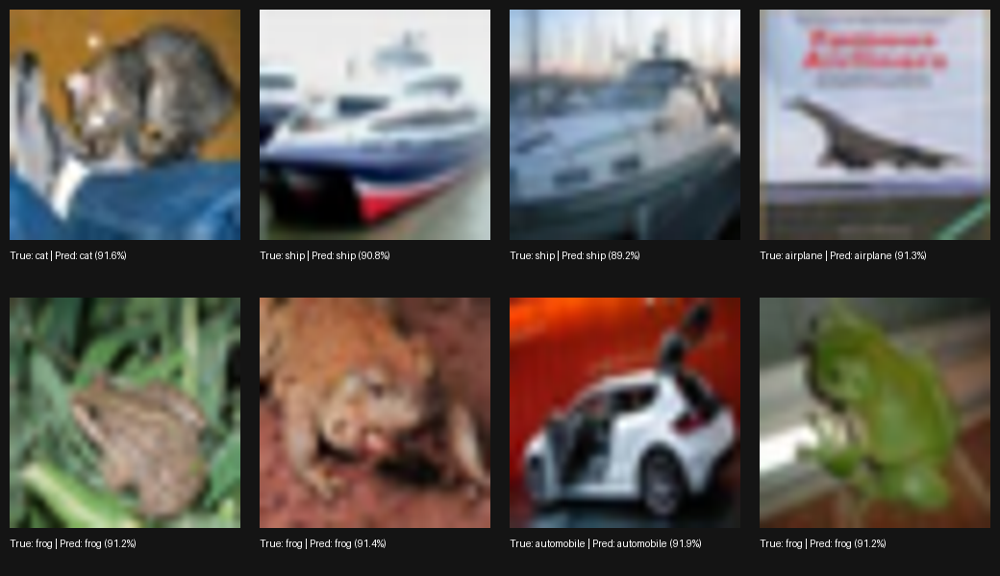

# CIFAR-10 Image Classifier — Deep CNN with Residual Connections

A PyTorch implementation of a custom ResNet-style CNN trained on CIFAR-10, achieving high-confidence predictions across all 10 object categories. Includes full training pipeline, mixed-precision GPU support, and an inference module for real-world images.

---

## Demo

| Real-world inference | Test set gallery |
|---|---|
|  |  |

The model correctly classifies real-world images (e.g. a Ferrari → **automobile**) and achieves **~90–92% confidence** on CIFAR-10 test samples.

---

## Model Architecture

The model (`DeepCNN`) is a 4-stage convolutional network with residual skip connections, inspired by ResNet.

```
Input (3 × 32 × 32)
    │
    ├── Stage 1: Conv(3→64) + BN + ReLU → ResBlock×2 → MaxPool  [32→16]
    ├── Stage 2: Conv(64→128) + BN + ReLU → ResBlock×2 → MaxPool [16→8]
    ├── Stage 3: Conv(128→256) + BN + ReLU → ResBlock×2 → MaxPool [8→4]
    └── Stage 4: Conv(256→512) + BN + ReLU → ResBlock×1 → AdaptiveAvgPool [4→1]
    │
    └── Classifier: Flatten → Dropout(0.4) → FC(512→256) → ReLU → Dropout(0.3) → FC(256→10)
```

**ResBlock** — two `3×3 Conv + BatchNorm` layers with an additive skip connection:
```
output = ReLU(x + Conv→BN→ReLU→Conv→BN(x))
```

---

## Training Configuration

| Hyperparameter | Value |
|---|---|
| Epochs | 30 |
| Batch size | 512 (up to 1024 for 8+ GB VRAM) |
| Optimizer | AdamW (`lr=0.001`, `weight_decay=1e-4`) |
| LR scheduler | OneCycleLR (`max_lr=0.01`) |
| Loss | CrossEntropyLoss (`label_smoothing=0.1`) |
| Mixed precision | ✅ `torch.cuda.amp` (fp16 forward, fp32 accumulation) |
| Gradient clipping | `max_norm=1.0` |

**Data augmentation (train only):**
- `RandomCrop(32, padding=4)`
- `RandomHorizontalFlip`
- `ColorJitter(brightness=0.2, contrast=0.2, saturation=0.2)`
- Normalize: mean `(0.4914, 0.4822, 0.4465)`, std `(0.2023, 0.1994, 0.2010)`

---

## Dataset

[CIFAR-10](https://www.cs.toronto.edu/~kriz/cifar.html) — 60,000 RGB images (32×32), split into 50,000 train / 10,000 test across 10 classes:

`airplane` · `automobile` · `bird` · `cat` · `deer` · `dog` · `frog` · `horse` · `ship` · `truck`

Downloaded automatically via `torchvision.datasets.CIFAR10`.

---

## Setup

**Requirements:** Python 3.12 or 3.13, CUDA-capable GPU recommended.

```bash
pip install torch torchvision torchinfo pillow
```

For CUDA (RTX 3050 / cu121):
```bash
pip install torch torchvision --index-url https://download.pytorch.org/whl/cu121
```

> ⚠️ PyTorch prebuilt CUDA wheels are not available for Python 3.14+. Use Python 3.12/3.13.

---

## Usage

### 1. Train

Open `cnn_main.ipynb` and run the training cell. The trained weights are saved to `cifar10_cnn.pth`.

```
Epoch 30/30  loss: 0.412  train: 93.2%  test: 91.8%  time: 38.4s  VRAM: 1840/2210 MB
Model saved → cifar10_cnn.pth
```

### 2. Evaluate on test set

```python
metrics = evaluate_test_set()
# Prints overall accuracy + per-class breakdown
```

### 3. Predict on a custom image

```python
predict_image('/path/to/your/image.jpg')
# Returns top-3 predictions with confidence scores
```

The image is resized to 32×32 internally (CIFAR-10 input size). Works best on images resembling CIFAR-10 categories.

### 4. Visualize test predictions

```python
show_test_predictions(n=8)
# Saves test_predictions_gallery.png with true/predicted labels
```

---

## Output Files

| File | Description |
|---|---|
| `cifar10_cnn.pth` | Trained model weights |
| `prediction_original.png` | Original input image (256×256 preview) |
| `prediction_preview.png` | Input image with label overlay |
| `test_predictions_gallery.png` | Grid of test samples with true/predicted labels |

---

## Project Structure

```
├── cnn_main.ipynb              # Full training + inference notebook
├── cifar10_cnn.pth             # Saved model weights (after training)
├── prediction_original.png     # Last custom image prediction input
├── prediction_preview.png      # Last custom image prediction preview
├── test_predictions_gallery.png# Test set prediction gallery
└── data/                       # CIFAR-10 dataset (auto-downloaded)
```
